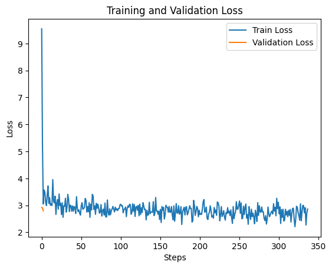

# Introduction

In this notebook, you will create a medical chatbot based on the model **[aaditya/Llama3-OpenBioLLM-8B](https://huggingface.co/aaditya/Llama3-OpenBioLLM-8B)** and also perform LoRA fine-tuning with the dataset `intern_screening_dataset.csv`.

<br>

You can access the notebook on Google Colab through the following link: **[Google Colab Notebook](https://colab.research.google.com/drive/1FvwteGpzqEUmcHqN_WqmMC1PPpwmYZ-E?usp=sharing)**


<br>

## Problem Statement

Develop a medical question-answering system utilizing the provided dataset containing medical information. The goal is to create a model that can effectively answer user queries related to medical diseases. You are free to augment the provided dataset with other medical datasets if you feel it is necessary.

<br>

### Constraints

The chatbot must be developed within a 2-day deadline, but future improvements are suggested at the end.

<br>

### Approaches Evaluated

- My initial idea was to use a transformer model with fewer parameters, such as **BERT** or **T5**, but I was concerned about the potential risk of hallucinations in the completions.
- I also considered running a **RAG** on a more powerful model like **GPT** and kept this alternative as a viable option.
- I ultimately decided to go with fine-tuning a **LLM** model to ensure more reliable, domain-specific answers by leveraging a pretrained model with large medical datasets.
- The deadline was an issue, as full fine-tuning could take days. To optimize time, I chose to use **PEFT LoRA**.

<br>

### Notebook Instance

Fine-tuning was performed using an **A100 instance on Google Colab**.


## Requirements


```python
!pip install pandas
!pip install re
!pip install datasets
!pip install transformers
!pip install torch
!pip install evaluate
!pip install peft
!pip install rouge-score
!pip install matplotlib

```

## Exploratory Data Analysis

This is an example of an entry in the dataset **intern_screening_dataset.csv**, which contains the columns **question** and **answer**:

<br>

**Question:**
> *What are the symptoms of Diabetes?*

**Answer:**
> Diabetes is often called a "silent" disease because it can cause serious complications even before you have symptoms. Symptoms can also be so mild that you don't notice them. An estimated 8 million people in the United States have type 2 diabetes and don't know it, according to 2012 estimates by the Centers for Disease Control and Prevention (CDC) *(continues…)*.

<br>

I assessed the data integrity by checking for missing columns in the dataset with the script `exploratory_data_analysis.py`:


```python
import pandas as pd

df = pd.read_csv('./data/raw/intern_screening_dataset.csv')

print(f"Total number of entries: {df.shape[0]}")

print(f"Empty questions: {df['question'].isnull().sum()}")
print(f"Empty answers: {df['answer'].isnull().sum()}")

df['question_answer'] = df['question'] + '|' + df['answer']
duplicate_count = df['question_answer'].duplicated().sum()
print(f"Duplicated question-answer pairs: {duplicate_count}")

```

    Total number of entries: 16406
    Empty questions: 0
    Empty answers: 5
    Duplicated question-answer pairs: 52


Before starting the Data Preprocessing, I decided to first perform the Model Selection in order to use the tokenizer tailored for this model and to prepare the columns expected for fine-tuning.

<br>

I researched similar applications and found many Open Source models on Hugging Face:

- [Medical LLM Leaderboard - Fenglin Liu](https://huggingface.co/spaces/fenglinliu/medical_llm_leaderboard)
- [Medical-Llama3-v2 - Ruslanmv](https://huggingface.co/spaces/ruslanmv/Medical-Llama3-v2)
- [Open Medical LLM Leaderboard - Open Life Science AI](https://huggingface.co/spaces/openlifescienceai/open_medical_llm_leaderboard)
- [MedLLMs Practical Guide - AI in Health](https://github.com/AI-in-Health/MedLLMsPracticalGuide?tab=readme-ov-file)
- [Open Medical LLM Leaderboard - Open Life Science AI](https://huggingface.co/spaces/openlifescienceai/open_medical_llm_leaderboard)
- [Hugging Face Blog - Medical LLM Leaderboard](https://huggingface.co/blog/leaderboard-medicalllm)

<br>

I would have liked to evaluate the models more thoroughly, but due to time constraints, I decided to choose the aaditya/Llama3-OpenBioLLM-70B model, which stood out for surpassing GPT and Gemini models in benchmarks:

<br>


Due to being a 70B model, fine-tuning became computationally infeasible, but OpenBioLLM has a smaller 8B variant that fits within the GPU capacity of a Google Colab A100 instance.

<br>

Since OpenBioLLM was trained on a vast corpus of high-quality biomedical data, it meets the task requirement that states "You are free to augment the provided dataset with other medical datasets if you feel it is necessary."

<br>

The model fetch may take up to 10 minutes, so I created the fetch_model.py script to save the model and tokenizer in a local directory:


```python
import transformers
import torch

# Fetch model from Hugging Face
model_id = "aaditya/OpenBioLLM-Llama3-8B"
model = transformers.AutoModelForCausalLM.from_pretrained(model_id, torch_dtype=torch.float16)
tokenizer = transformers.AutoTokenizer.from_pretrained(model_id)

# Save model and tokenizer locally
save_directory = "./models"
model.save_pretrained(save_directory)
tokenizer.save_pretrained(save_directory)

print(f"Model and Tokenizer saved in: {save_directory}")

```

    Model and Tokenizer saved in: ./models


<br>

The script `test_reference_model.py` allows testing the Question Answering task of the **OpenBioLLM-Llama3-8B** model.
The script follows the snippet on the OpenBioLLM-8B page: https://huggingface.co/aaditya/Llama3-OpenBioLLM-8B


```python
import transformers
import torch

model_id = "aaditya/OpenBioLLM-Llama3-8B"

pipeline = transformers.pipeline(
    "text-generation",
    model=model_id,
    model_kwargs={"torch_dtype": torch.bfloat16},
    device="cuda",
)

# Prompt context and question
messages = [
    {"role": "system", "content": "You are an expert and experienced from the healthcare and biomedical domain with extensive medical knowledge and practical experience. Your name is OpenBioLLM, and you were developed by Saama AI Labs. who's willing to help answer the user's query with explanation. In your explanation, leverage your deep medical expertise such as relevant anatomical structures, physiological processes, diagnostic criteria, treatment guidelines, or other pertinent medical concepts. Use precise medical terminology while still aiming to make the explanation clear and accessible to a general audience."},
    {"role": "user", "content": "What are the symptoms of Diabetes?"}
]

# Prompt building
prompt = ""
for message in messages:
    prompt += f"{message['role'].capitalize()}: {message['content']}\n"

outputs = pipeline(
    prompt,
    max_new_tokens=512,
    do_sample=True,
    temperature=0.1,
    top_p=0.9,
    eos_token_id=pipeline.tokenizer.eos_token_id,
)

print(outputs[0]["generated_text"][len(prompt):])

```

    OpenBioLLM: Diabetes is a chronic condition that affects the body's ability to regulate blood sugar levels. Common symptoms of diabetes include frequent urination, excessive thirst, unexplained weight loss, increased hunger, fatigue, blurred vision, slow-healing sores or frequent infections, and tingling or numbness in the hands or feet. These symptoms may vary from person to person and can also be associated with other medical conditions. It is important to consult a healthcare professional for an accurate diagnosis and appropriate management of diabetes.


## Data Preprocessing

The `data_preprocessing.py` script performs the following techniques:

- Removed entries with missing answers.
- Removed duplicate question-answer pairs.
- Dropped answers shorter than 100 characters.
- Normalized text (lowercase and stripped spaces).
- Removed special characters.
- Tokenized questions and answers using Hugging Face AutoTokenizer, creating `input_ids` and labels.
- Truncated and padded sequences to a maximum length of 512.
- Computed start and end token positions for answers using `char_to_token`.
- Converted the cleaned DataFrame to a Hugging Face Dataset and saved it.

I encountered some difficulty aligning the columns correctly when preparing the dataset for fine-tuning, particularly ensuring that the columns `input_ids`, `labels`, `start_positions`, and `end_positions` were properly formatted.

<br>

To develop the `get_answer_positions` function, I consulted the following resources:

- [Hugging Face Custom Datasets Guide](https://huggingface.co/transformers/v3.1.0/custom_datasets.html)
- [Hugging Face Documentation on Question Answering](https://huggingface.co/docs/transformers/tasks/question_answering)
- [WandB Article on Extractive Question Answering with Hugging Face](https://wandb.ai/mostafaibrahim17/ml-articles/reports/Extractive-Question-Answering-With-HuggingFace-Using-PyTorch-and-W-B--Vmlldzo0MzMwOTY5)

<br>


```python
import pandas as pd
import re
from datasets import Dataset
from transformers import AutoTokenizer

# Special characters cleaning
def clean_text(text):
    text = re.sub(r'[^\w\s]', '', text)  # Punctuation
    text = re.sub(r'\d+', '', text)  # Numbers
    return text

# Get start and end positions of the answer
def get_answer_positions(question, answer):
    context = question + " " + answer
    start = context.find(answer)
    end = start + len(answer) - 1

    # Tokenize the context
    tokenized_context = tokenizer(context, truncation=True, padding='max_length', max_length=512)

    start_token_pos = tokenized_context.char_to_token(start)
    end_token_pos = tokenized_context.char_to_token(end)

    # Get last valid token in case of None
    if start_token_pos is None or end_token_pos is None:
        start_token_pos = len(tokenized_context['input_ids']) - 1
        end_token_pos = len(tokenized_context['input_ids']) - 1

    return start_token_pos, end_token_pos


df = pd.read_csv('./data/raw/intern_screening_dataset.csv')

# Removed entries with missing answers
df = df.dropna(subset=['answer'])

# Removed duplicate question-answer pairs
df['question_answer'] = df['question'] + ' | ' + df['answer']
df = df.drop_duplicates(subset='question_answer')
df.drop(columns='question_answer', inplace=True)

# Dropped answers shorter than 100 characters
df = df[df['answer'].str.strip().str.len() > 100]

# Normalized text (lowercase and stripped spaces)
df['question'] = df['question'].str.lower()
df['answer'] = df['answer'].str.lower()

df['question'] = df['question'].str.strip()
df['answer'] = df['answer'].str.strip()

# Removed special characters
df['question'] = df['question'].apply(clean_text)
df['answer'] = df['answer'].apply(clean_text)

# Tokenized questions and answers using Hugging Face AutoTokenizer, creating input_ids and labels
model_id = "aaditya/OpenBioLLM-Llama3-8B"
tokenizer = AutoTokenizer.from_pretrained(model_id)

df['input_ids'] = df['question'].apply(lambda x: tokenizer.encode(x, padding='max_length', truncation=True, max_length=512))
df['labels'] = df['answer'].apply(lambda x: tokenizer.encode(x, padding='max_length', truncation=True, max_length=512))

# Computed start and end token positions for answers using char_to_token
df['start_positions'], df['end_positions'] = zip(*df.apply(lambda x: get_answer_positions(x['question'], x['answer']), axis=1))

# Drop as colunas question e answer
df.drop(columns=['question', 'answer'], inplace=True)

# Keeping only necessary columns
df = df.reset_index(drop=True)
df = df[['input_ids', 'labels', 'start_positions', 'end_positions']]

print(df.head(5))

# Converted the cleaned DataFrame to a Hugging Face Dataset and saved it
dataset = Dataset.from_pandas(df)
dataset.save_to_disk('./data/processed/intern_screening_dataset')

```


                                               input_ids  \
    0  [12840, 374, 527, 2840, 2933, 82945, 220, 1280...   
    1  [12840, 374, 527, 2840, 2933, 82945, 220, 1280...   
    2  [12840, 374, 527, 2840, 2933, 82945, 220, 1280...   
    3  [14965, 374, 520, 5326, 369, 2840, 2933, 82945...   
    4  [5269, 311, 5471, 2840, 2933, 82945, 220, 1280...   
    
                                                  labels  start_positions  \
    0  [6200, 2933, 82945, 374, 264, 1912, 315, 19338...                7   
    1  [1820, 81209, 32015, 374, 264, 13190, 315, 810...                7   
    2  [2569, 4134, 2840, 2933, 82945, 374, 279, 1455...                7   
    3  [3852, 606, 649, 2274, 2840, 2933, 82945, 1063...                9   
    4  [266, 420, 892, 584, 656, 539, 1440, 1268, 311...                7   
    
       end_positions  
    0            134  
    1             26  
    2            107  
    3            112  
    4             97  


<br>

## Model Training

The `fine_tuning.py` script performs PEFT LoRA fine-tuning for the Question Answering task. The training took approximately 2 hours and was conducted with standard hyperparameters:

<br>

I used the following resources as references to develop the fine-tuning LoRA function for the Llama 3-8B model:

- [Fine-tuning Llama 2 models using a single GPU, QLoRA, and AI Notebooks](https://blog.ovhcloud.com/fine-tuning-llama-2-models-using-a-single-gpu-qlora-and-ai-notebooks/)
- [Fine-tuning Llama 2 using LoRA and QLoRA: A Comprehensive Guide](https://medium.com/@harsh.vardhan7695/fine-tuning-llama-2-using-lora-and-qlora-a-comprehensive-guide-fd2260f0aa5f)
- [Fine-tuning Large Language Models: Customize Llama 3-8B for Your Needs](https://medium.com/@miloszivic99/finetuning-large-language-models-customize-llama-3-8b-for-your-needs-bfe0f43cd239)
- [How to Fine-tune Llama 3-1.8B Instruct](https://medium.com/@rschaeffer23/how-to-fine-tune-llama-3-1-8b-instruct-bf0a84af7795)
- [Fine-tuning Llama3 for Q&A Tasks using Unsloth](https://www.kaggle.com/code/lhai0704/fine-tuning-llama3-for-q-a-tasks-using-unsloth)
- [Fine-tuning Llama3 Locally](https://www.datacamp.com/tutorial/llama3-fine-tuning-locally)


```python
import json
import torch
import matplotlib.pyplot as plt
from datasets import load_from_disk, Dataset
from peft import get_peft_model, LoraConfig
from transformers import AutoTokenizer, AutoModelForCausalLM, Trainer, TrainingArguments
from evaluate import load as load_metric

# Load preprocessed dataset
tokenized_datasets = load_from_disk('./data/processed')
tokenized_datasets = tokenized_datasets.map(lambda x: {'id': list(range(len(x)))})
train_test_split = tokenized_datasets.train_test_split(test_size=0.3)

# Loading reference model
model_id = "aaditya/OpenBioLLM-Llama3-8B"
tokenizer = AutoTokenizer.from_pretrained(model_id)
model = AutoModelForCausalLM.from_pretrained(model_id, torch_dtype=torch.float16)

# GPU selection
device = torch.device("cuda" if torch.cuda.is_available() else "cpu")
model.to(device)

# LoRA initialization
lora_config = LoraConfig(
    r=16,
    lora_alpha=32,
    lora_dropout=0.1,
    task_type="QUESTION_ANS"
)

peft_model = get_peft_model(model, lora_config)

# Initializing training
training_args = TrainingArguments(
    output_dir="./results_qa",
    evaluation_strategy="epoch",
    learning_rate=5e-5,
    per_device_train_batch_size=2,
    num_train_epochs=3,
    weight_decay=0.01,
    logging_dir="./logs",
    save_total_limit=2,
    save_strategy="epoch",
    fp16=False,
    logging_steps=50,
    logging_first_step=True,
    report_to="tensorboard",
    disable_tqdm=False,
    no_cuda=False,
    remove_unused_columns=False
)

trainer = Trainer(
    model=peft_model,
    args=training_args,
    train_dataset=train_test_split["train"],
    eval_dataset=train_test_split["test"]
)

trainer.train()

# Saving fine-tuned model
peft_model.save_pretrained('./finetune')

# Training and validation loss visualization
training_logs = trainer.state.log_history

train_loss = [log['loss'] for log in training_logs if 'loss' in log]
eval_loss = [log['eval_loss'] for log in training_logs if 'eval_loss' in log]

plt.plot(train_loss, label="Train Loss")
plt.plot(eval_loss, label="Validation Loss")
plt.xlabel("Steps")
plt.ylabel("Loss")
plt.legend()
plt.title("Training and Validation Loss")
plt.show()

```
<table border="1" class="dataframe">
  <thead>
 <tr style="text-align: left;">
      <th>Epoch</th>
      <th>Training Loss</th>
      <th>Validation Loss</th>
    </tr>
  </thead>
  <tbody>
    <tr>
      <td>1</td>
      <td>3.018700</td>
      <td>2.919188</td>
    </tr>
    <tr>
      <td>2</td>
      <td>2.968500</td>
      <td>2.902077</td>
    </tr>
    <tr>
      <td>3</td>
      <td>2.861300</td>
      <td>2.797840</td>
    </tr>
  </tbody>
</table><p>


    
   


The fine-tuning is converging, as both the Training Loss and Validation Loss are decreasing with each epoch.  

<br>

It would be beneficial to run for more epochs and perform hyperparameter tuning. However, due to time constraints, I will proceed to the model evaluation stage.


## Model Evaluation

Since the reference model aaditya/Llama3-OpenBioLLM-8B was trained for the LlamaForCausalLM architecture, the most appropriate evaluation metric is ROUGE.

<br>

ROUGE is commonly used for evaluating text generation tasks, where the focus is on comparing the generated text with reference text based on recall, precision, and F1 score.

<br>

The script `model_evaluation.py` calculates the ROUGE for the **aaditya/Llama3-OpenBioLLM-8B** model with and without fine-tuning using the `intern_screening_dataset.csv` dataset:


```python
import transformers
import torch
import pandas as pd
from rouge_score import rouge_scorer

finetuned_model_id = "./finetune"
reference_model_id = "aaditya/OpenBioLLM-Llama3-8B"

# Reference and fine-tuned models pipelines
finetuned_pipeline = transformers.pipeline(
    "text-generation",
    model=finetuned_model_id,
    model_kwargs={"torch_dtype": torch.bfloat16},
    device="cuda",
)

reference_pipeline = transformers.pipeline(
    "text-generation",
    model=reference_model_id,
    model_kwargs={"torch_dtype": torch.bfloat16},
    device="cuda",
)

# Loading dataset and selecting 10 example questions
csv_path = "./data/raw/intern_screening_dataset.csv"
df = pd.read_csv(csv_path)

questions_indexes = [1, 13, 62, 91, 118, 228, 250, 302, 443, 612]

# Initializing ROUGE scorer
scorer = rouge_scorer.RougeScorer(['rouge1', 'rouge2', 'rougeL'], use_stemmer=True)

rouge_scores_finetuned = []
rouge_scores_reference = []

# Iterating over example questions
for idx in questions_indexes:
    question = df.iloc[idx]['question']
    answer_from_dataset = df.iloc[idx]['answer']

    messages = [
        {"role": "system", "content": "You are an expert and experienced from the healthcare and biomedical domain with extensive medical knowledge and practical experience. Your name is OpenBioLLM, and you were developed by Saama AI Labs. who's willing to help answer the user's query with explanation. In your explanation, leverage your deep medical expertise such as relevant anatomical structures, physiological processes, diagnostic criteria, treatment guidelines, or other pertinent medical concepts. Use precise medical terminology while still aiming to make the explanation clear and accessible to a general audience."},
        {"role": "user", "content": question}
    ]

    # Prompt building
    prompt = ""
    for message in messages:
        prompt += f"{message['role'].capitalize()}: {message['content']}\n"

    # Fine-tuned model output
    finetuned_outputs = finetuned_pipeline(
        prompt,
        max_new_tokens=512,
        do_sample=True,
        temperature=0.3,
        top_p=0.9,
        eos_token_id=finetuned_pipeline.tokenizer.eos_token_id,
    )

    # Reference model output
    reference_outputs = reference_pipeline(
        prompt,
        max_new_tokens=512,
        do_sample=True,
        temperature=0.3,
        top_p=0.9,
        eos_token_id=reference_pipeline.tokenizer.eos_token_id,
    )

    finetuned_generated_text = finetuned_outputs[0]['generated_text'][len(prompt):]
    reference_generated_text = reference_outputs[0]['generated_text'][len(prompt):]

    # Removing OpenBioLLM from answer
    finetuned_generated_text = finetuned_generated_text.replace("OpenBioLLM:", "").strip()
    reference_generated_text = reference_generated_text.replace("OpenBioLLM:", "").strip()

    # Calculating ROUGE
    finetuned_rouge_score = scorer.score(answer_from_dataset, finetuned_generated_text)
    reference_rouge_score = scorer.score(answer_from_dataset, reference_generated_text)

    rouge_scores_finetuned.append(finetuned_rouge_score)
    rouge_scores_reference.append(reference_rouge_score)

    print(f"Question: {question}")
    print(f"Answer from Dataset: {answer_from_dataset}")
    print(f"Answer from Fine-tuned Model: {finetuned_generated_text}")
    print(f"Answer from Reference Model: {reference_generated_text}")
    print("-" * 50)

# Printing ROUGE metrics
def average_rouge(rouge_scores):
    rouge1_f1 = sum(score['rouge1'].fmeasure for score in rouge_scores) / len(rouge_scores)
    rouge2_f1 = sum(score['rouge2'].fmeasure for score in rouge_scores) / len(rouge_scores)
    rougeL_f1 = sum(score['rougeL'].fmeasure for score in rouge_scores) / len(rouge_scores)
    return {'rouge1_f1': rouge1_f1, 'rouge2_f1': rouge2_f1, 'rougeL_f1': rougeL_f1}

avg_rouge_finetuned = average_rouge(rouge_scores_finetuned)
avg_rouge_reference = average_rouge(rouge_scores_reference)

print("Average ROUGE scores for Fine-tuned Model:", avg_rouge_finetuned)
print("Average ROUGE scores for Reference Model:", avg_rouge_reference)

```

    Question: What is (are) Glaucoma ?
    Answer from Dataset: The optic nerve is a bundle of more than 1 million nerve fibers. It connects the retina to the brain.
    Answer from Fine-tuned Model: Glaucoma is a group of eye conditions that damage the optic nerve, usually due to increased intraocular pressure. It can lead to vision loss if left untreated. There are two main types of glaucoma: primary open-angle glaucoma and angle-closure glaucoma. Primary open-angle glaucoma is more common and occurs when the drainage angle formed by the cornea and iris becomes clogged over time. Angle-closure glaucoma happens when the fluid in the front part of the eye cannot circulate properly because the drainage angle is blocked.
    Answer from Reference Model: Glaucoma is a group of eye conditions that lead to optic nerve damage and can result in vision loss. It is often associated with increased intraocular pressure, which damages the optic nerve over time. There are two main types of glaucoma: primary open-angle glaucoma, which is the most common type, and angle-closure glaucoma. Early diagnosis and treatment are crucial to prevent further vision loss.
    --------------------------------------------------
    Question: How to prevent High Blood Pressure ?
    Answer from Dataset: Steps You Can Take You can take steps to prevent high blood pressure by adopting these healthy lifestyle habits. - Follow a healthy eating plan.   - Be physically active.   - Maintain a healthy weight.  - If you drink alcoholic beverages, do so in moderation.   - Quit smoking.  - Learn to cope with and manage stress. Follow a healthy eating plan. Be physically active. Maintain a healthy weight. If you drink alcoholic beverages, do so in moderation. Quit smoking. Learn to cope with and manage stress. Follow a Healthy Eating Plan Follow a healthy eating plan that emphasizes fruits, vegetables, fat-free or low-fat milk and milk products, and whole grains, and that is low in saturated fat, cholesterol, and total fat. Eating this way is even more effective when you also reduce your sodium (salt) intake and calories. One such eating plan is called DASH. DASH stands for Dietary Approaches to Stop Hypertension. This is the name of a study sponsored by the National Institutes of Health that showed that this kind of eating plan can help you prevent and control high blood pressure. The study also showed that combining this kind of eating plan with cutting back on salt in your diet is even more effective at lowering your blood pressure. To learn more about DASH, see  Lowering Your Blood Pressure with DASH. Lower Your Salt Intake In general, the lower your salt intake, the lower your blood pressure. Older adults should limit their sodium intake to 2,300 milligrams (mg) daily. The key to reducing the amount of salt we eat is making wise food choices. Only a small amount of the salt that we eat comes from the salt shaker, and only small amounts occur naturally in food. Most of the salt that we eat comes from processed foods -- for example, canned or processed meat, baked goods, certain cereals, soy sauce, and foods that contain seasoned salts, monosodium glutamate (MSG), and baking soda. Food from fast food restaurants, frozen foods, and canned foods also tend to be higher in sodium. See tips to reduce salt in your diet. Read Food Labels Be sure to read food labels to choose products lower in salt. Look for foods and seasonings that are labeled as low-salt or "no added salt." Look for the sodium content in milligrams and the Percent Daily Value. Aim for foods that are less than 5 percent of the Daily Value of sodium. Foods with 20 percent or more Daily Value of sodium are considered high. To learn more about reading nutrition labels, see  Reading the Label. Be Physically Active  Regular physical activity can lower high blood pressure and reduce your risk for other health problems. Everyone should try to participate in moderate-intensity aerobic exercise at least 2 hours and 30 minutes per week, or vigorous-intensity aerobic exercise for 1 hour and 15 minutes per week. Aerobic exercise, such as brisk walking, is any exercise in which your heart beats harder and you use more oxygen than usual. The more active you are, the more you will benefit. Participate in aerobic exercise for at least 10 minutes at a time, spread throughout the week. (Watch the video to learn how exercise maintains healthy aging. To enlarge the video, click the brackets in the lower right-hand corner. To reduce the video, press the Escape (Esc) button on your keyboard.) Most people dont need to see a doctor before they start a moderate-level physical activity. You should check first with your doctor if you - have heart trouble or have had a heart attack   - are over age 50 and are not used to moderate-level physical activity  - have a family history of heart disease at an early age, or if you have any other serious health problem. have heart trouble or have had a heart attack are over age 50 and are not used to moderate-level physical activity have a family history of heart disease at an early age, or if you have any other serious health problem. See examples of exercises for older adults at Exercises to Try. For more on exercise and physical activity for older adults, visit Go4Life, the exercise and physical activity campaign from the National Institute on Aging. Maintain a Healthy Weight Maintaining a healthy weight can help you control high blood pressure and reduce your risk for other health problems. Blood pressure rises as body weight increases. Losing even 10 pounds can lower blood pressure -- and it has the greatest effect for those who are overweight and already have hypertension. A useful measure of overweight and obesity is body mass index (BMI). BMI measures your weight in relation to your height.  See the BMI calculator to determine your body mass index  or talk to your health care provider. A BMI -  below 18.5 is a sign that you are underweight.   - between 18.5 and 24.9 is in the healthy range.  - between 25 and 29.9 is considered overweight.  - of 30 or more is considered obese. below 18.5 is a sign that you are underweight. between 18.5 and 24.9 is in the healthy range. between 25 and 29.9 is considered overweight. of 30 or more is considered obese. A general goal to aim for is a BMI below 25. Your health care provider can help you set an appropriate BMI goal. Measuring waist circumference helps screen for possible health risks. If most of your fat is around your waist rather than at your hips, youre at a higher risk for heart disease and type 2 diabetes. This risk may be high with a waist size that is greater than 35 inches for women or greater than 40 inches for men. To learn how to measure your waist, visit  Assessing Your Weight and Health Risk. For more information about losing weight or maintaining your weight, see Aim for a Healthy Weight.  If You Drink  Drinking too much alcohol can raise your blood pressure. Alcohol also adds extra calories, which may cause weight gain. Men should have no more than two drinks a day, and women should have no more than one drink a day. If you drink and would like tips on how to cut back, watch the video "How To Cut Back on Your Drinking." (To enlarge the video, click the brackets in the lower right-hand corner. To reduce the video, press the Escape (Esc) button on your keyboard.) See how drinking alcohol can affect you as you age. Don't Smoke Smoking injures blood vessel walls and speeds up the process of hardening of the arteries. It increases your chances of stroke, heart disease, peripheral arterial disease, and several forms of cancer. If you smoke, quit. If you don't smoke, don't start. Once you quit, your risk of having a heart attack is reduced after the first year. So you have a lot to gain by quitting. See how to start a smoking quit plan geared to older adults.
    Answer from Fine-tuned Model: To prevent high blood pressure, it is important to adopt a healthy lifestyle. Here are some recommendations:  1. Maintain a healthy weight: Being overweight or obese increases the risk of high blood pressure. Aim for a body mass index (BMI) within the normal range (18.5-24.9).  2. Eat a balanced diet: Follow the Dietary Approaches to Stop Hypertension (DASH) eating plan, which emphasizes fruits, vegetables, whole grains, lean proteins, and low-fat dairy products. Limit sodium intake to less than 2,300 milligrams per day.  3. Reduce sodium intake: Consuming too much sodium can raise blood pressure. Aim to limit sodium intake to no more than 1,500 milligrams per day, or even lower if advised by your healthcare provider.  4. Exercise regularly: Engage in moderate aerobic exercise for at least 150 minutes per week, or vigorous aerobic exercise for 75 minutes per week. Additionally, include muscle-strengthening activities at least twice a week.  5. Limit alcohol consumption: Excessive alcohol intake can raise blood pressure. Men should limit to two drinks per day, while women should limit to one drink per day.  6. Quit smoking: Smoking damages blood vessels and increases the risk of high blood pressure. Seek support from healthcare professionals to quit smoking.  7. Manage stress: Chronic stress can contribute to high blood pressure. Practice stress management techniques such as meditation, deep breathing exercises, or engaging in hobbies that you enjoy.  8. Limit caffeine intake: While the effect of caffeine on blood pressure can vary from person to person, it is generally recommended to limit caffeine intake to moderate levels.  9. Monitor blood pressure regularly: Regularly monitor your blood pressure at home using a reliable blood pressure monitor. This will help you track your progress and detect any changes in your blood pressure.  Remember, these are general preventive measures, and it is always best to consult with your healthcare provider for personalized advice based on your specific health condition.
    Answer from Reference Model: To prevent high blood pressure, it is important to adopt a healthy lifestyle. Here are some recommendations: 1. Maintain a healthy weight: Aim for a body mass index (BMI) within the normal range (18.5-24.9). 2. Eat a balanced diet: Follow the Dietary Approaches to Stop Hypertension (DASH) eating plan, which emphasizes fruits, vegetables, whole grains, lean proteins, and low-fat dairy products while limiting sodium, saturated fats, and added sugars. 3. Reduce sodium intake: Limit sodium consumption to less than 2,300 milligrams per day (or even lower if you have high blood pressure or other cardiovascular risk factors). 4. Exercise regularly: Engage in moderate aerobic exercise for at least 150 minutes per week, or vigorous aerobic exercise for 75 minutes per week, along with muscle-strengthening activities twice a week. 5. Limit alcohol consumption: Men should limit alcohol intake to no more than two drinks per day, and women should limit it to one drink per day. 6. Quit smoking: Smoking damages blood vessels and increases the risk of hypertension. 7. Manage stress: Practice stress management techniques such as meditation, deep breathing exercises, or engaging in hobbies that you enjoy. 8. Limit caffeine intake: While there is mixed evidence on the direct link between caffeine and hypertension, it is generally recommended to limit caffeine intake to moderate levels. 9. Monitor blood pressure regularly: Regularly measure your blood pressure at home and discuss the results with your healthcare provider. 10. Follow medication instructions: If prescribed medication for high blood pressure, take it as directed by your healthcare provider.  Remember, these recommendations may vary depending on individual circumstances, so it is important to consult with a healthcare professional for personalized guidance.
    --------------------------------------------------
    Question: What are the treatments for Osteoarthritis ?
    Answer from Dataset: Treatment Goals: Manage Pain, Improve Function Osteoarthritis treatment plans often include ways to manage pain and improve function. Such plans can include exercise, rest and joint care, pain relief, weight control, medicines, surgery, and non-traditional treatment approaches. Current treatments for osteoarthritis can relieve symptoms such as pain and disability, but right now there are no treatments that can cure osteoarthritis. Exercise: One of the Best Treatments Exercise is one of the best treatments for osteoarthritis. It can improve mood and outlook, decrease pain, increase flexibility, and help you maintain a healthy weight. The amount and form of exercise will depend on which joints are involved, how stable the joints are, whether or not the joint is swollen, and whether a joint replacement has already been done. Ask your doctor or physical therapist what exercises are best for you The following types of exercise are part of a well-rounded arthritis treatment plan. -  Strengthening exercises.  These exercises strengthen muscles that support joints affected by arthritis. They can be performed with weights or with exercise bands, inexpensive devices that add resistance.  - Aerobic activities.  These are exercises, such as brisk walking or low-impact aerobics, that get your heart pumping and can keep your lungs and circulatory system in shape.   -  Range-of-motion activities.  These keep your joints limber.  - Balance and agility exercises.  These help you maintain your balance and reduce the risk of falling.   Strengthening exercises.  These exercises strengthen muscles that support joints affected by arthritis. They can be performed with weights or with exercise bands, inexpensive devices that add resistance. Aerobic activities.  These are exercises, such as brisk walking or low-impact aerobics, that get your heart pumping and can keep your lungs and circulatory system in shape.  Range-of-motion activities.  These keep your joints limber. Balance and agility exercises.  These help you maintain your balance and reduce the risk of falling. To see examples of exercises for older adults, see  Exercises to Try or visit Go4Life,  the National Institute on Agings exercise and physical activity program for older adults. Weight Control If you are overweight or obese, you should try to lose weight. Weight loss can reduce stress on weight-bearing joints, limit further injury, increase mobility, and reduce the risk of associated health problems. A dietitian can help you develop healthy eating habits. A healthy diet and regular exercise help reduce weight. Rest and Relief from Stress on Joints Treatment plans include regularly scheduled rest. You must learn to recognize the bodys signals, and know when to stop or slow down. This will prevent the pain caused by overexertion. Although pain can make it difficult to sleep, getting proper sleep is important for managing arthritis pain. If you have trouble sleeping, you may find that relaxation techniques, stress reduction, and biofeedback can help. Timing medications to provide maximum pain relief through the night can also help. If joint pain interferes with your ability to sleep or rest, consult your doctor. Some people find relief from special footwear and insoles that can reduce pain and improve walking or from using canes to take pressure off painful joints. They may use splints or braces to provide extra support for joints and/ or keep them in proper position during sleep or activity. Splints should be used only for limited periods of time because joints and muscles need to be exercised to prevent stiffness and weakness. If you need a splint, an occupational therapist or a doctor can help you get a properly fitted one. Non-drug Pain Relief and Alternative Therapies People with osteoarthritis may find many nondrug ways to relieve pain. Below are some examples. - Heat and cold. Heat or cold (or a combination of the two) can be useful for joint pain. Heat can be applied in a number of different ways -- with warm towels, hot packs, or a warm bath or shower -- to increase blood flow and ease pain and stiffness. In some cases, cold packs (bags of ice or frozen vegetables wrapped in a towel), which reduce inflammation, can relieve pain or numb the sore area. (Check with a doctor or physical therapist to find out if heat or cold is the best treatment.) Heat and cold. Heat or cold (or a combination of the two) can be useful for joint pain. Heat can be applied in a number of different ways -- with warm towels, hot packs, or a warm bath or shower -- to increase blood flow and ease pain and stiffness. In some cases, cold packs (bags of ice or frozen vegetables wrapped in a towel), which reduce inflammation, can relieve pain or numb the sore area. (Check with a doctor or physical therapist to find out if heat or cold is the best treatment.) - Transcutaneous electrical nerve stimulation (TENS). TENS is a technique that uses a small electronic device to direct mild electric pulses to nerve endings that lie beneath the skin in the painful area. TENS may relieve some arthritis pain. It seems to work by blocking pain messages to the brain and by modifying pain perception. Transcutaneous electrical nerve stimulation (TENS). TENS is a technique that uses a small electronic device to direct mild electric pulses to nerve endings that lie beneath the skin in the painful area. TENS may relieve some arthritis pain. It seems to work by blocking pain messages to the brain and by modifying pain perception. - Massage.  In this pain-relief approach, a massage therapist will lightly stroke and/or knead the painful muscles. This may increase blood flow and bring warmth to a stressed area. However, arthritis-stressed joints are sensitive, so the therapist must be familiar with the problems of the disease.  Massage.  In this pain-relief approach, a massage therapist will lightly stroke and/or knead the painful muscles. This may increase blood flow and bring warmth to a stressed area. However, arthritis-stressed joints are sensitive, so the therapist must be familiar with the problems of the disease. -  Acupuncture.  Some people have found pain relief using acupuncture, a practice in which fine needles are inserted by a licensed acupuncture therapist at specific points on the skin. Scientists think the needles stimulate the release of natural, pain-relieving chemicals produced by the nervous system. A large study supported by the National Institute of Arthritis and Musculoskeletal and Skin Diseases (NIAMS) and the National Center for Complementary and Alternative Medicine (NCCAM) revealed that acupuncture relieves pain and improves function in knee osteoarthritis, and it serves as an effective complement to standard care.  Acupuncture.  Some people have found pain relief using acupuncture, a practice in which fine needles are inserted by a licensed acupuncture therapist at specific points on the skin. Scientists think the needles stimulate the release of natural, pain-relieving chemicals produced by the nervous system. A large study supported by the National Institute of Arthritis and Musculoskeletal and Skin Diseases (NIAMS) and the National Center for Complementary and Alternative Medicine (NCCAM) revealed that acupuncture relieves pain and improves function in knee osteoarthritis, and it serves as an effective complement to standard care. - Nutritional supplements, such as glucosamine and chondroitin sulfate have been reported to improve the symptoms of people with osteoarthritis, as have certain vitamins. Additional studies have been carried out to further evaluate these claims. It is unknown whether they might change the course of disease. Nutritional supplements, such as glucosamine and chondroitin sulfate have been reported to improve the symptoms of people with osteoarthritis, as have certain vitamins. Additional studies have been carried out to further evaluate these claims. It is unknown whether they might change the course of disease. - Folk remedies. These include the wearing of copper bracelets, following special diets, and rubbing WD-40 on joints to lubricate them. Although these practices may or may not be harmful, no scientific research to date shows that they are helpful in treating osteoarthritis. They can also be expensive, and using them may cause people to delay or even abandon useful medical treatment. Folk remedies. These include the wearing of copper bracelets, following special diets, and rubbing WD-40 on joints to lubricate them. Although these practices may or may not be harmful, no scientific research to date shows that they are helpful in treating osteoarthritis. They can also be expensive, and using them may cause people to delay or even abandon useful medical treatment. For general information on alternative therapies, see the Complementary Health Approaches topic. Medications Doctors consider a number of factors when choosing medicines for their patients. In particular, they look at the type of pain the patient may be having and any possible side effects from the drugs. For pain relief, doctors usually start with acetaminophen because the side effects are minimal. If acetaminophen does not relieve pain, then non-steroidal anti-inflammatory drugs such as ibuprofen and naproxen may be used. Some NSAIDs are available over the counter, while more than a dozen others, including a subclass called COX-2 inhibitors, are available only with a prescription. Other medications, including corticosteroids, hyaluronic acid, and topical creams are also used. Reduce the Risks of NSAID Use Most medicines used to treat osteoarthritis have side effects, so it is important for people to learn about the medicines they take. For example, people over age 65 and those with any history of ulcers or stomach bleeding should use non-steroidal anti-inflammatory drugs, or NSAIDs, with caution. There are measures you can take to help reduce the risk of side effects associated with NSAIDs. These include taking medications with food and avoiding stomach irritants such as alcohol, tobacco, and caffeine. In some cases, it may help to take another medication along with an NSAID to coat the stomach or block stomach acids. Although these measures may help, they are not always completely effective. For more tips on how older adults can avoid side effects, see Side Effects  in the Taking Medicines topic. Surgery For many people, surgery helps relieve the pain and disability of osteoarthritis. Surgery may be performed to achieve one or more of the following goals. - Removal of loose pieces of bone and cartilage from the joint if they are causing symptoms of buckling or locking (arthroscopic debridement).  - Repositioning of bones (osteotomy).  - Resurfacing (smoothing out) bones (joint resurfacing). Removal of loose pieces of bone and cartilage from the joint if they are causing symptoms of buckling or locking (arthroscopic debridement). Repositioning of bones (osteotomy). Resurfacing (smoothing out) bones (joint resurfacing). Joint Replacement Surgeons may replace affected joints with artificial joints called prostheses. These joints can be made from metal alloys, high-density plastic, and ceramic material. Some prostheses are joined to bone surfaces with special cements. Others have porous surfaces and rely on the growth of bone into that surface (a process called biologic fixation) to hold them in place. Artificial joints can last 10 to 15 years or longer. Surgeons choose the design and components of prostheses according to their patients weight, sex, age, activity level, and other medical conditions. Joint replacement advances in recent years have included the ability, in some cases, to replace only the damaged part of the knee joint, leaving undamaged parts of the joint intact, and the ability to perform hip replacement through much smaller incisions than previously possible. For more on joint replacement see the Hip Replacement and Knee Replacement topics. Deciding on Surgery The decision to use surgery depends on several factors, including the patients age, occupation, level of disability, pain intensity, and the degree to which arthritis interferes with his or her lifestyle. After surgery and rehabilitation, the patient usually feels less pain and swelling and can move more easily.
    Answer from Fine-tuned Model: There are several treatment options available for managing Osteoarthritis. These include:  1. Medications: Nonsteroidal anti-inflammatory drugs (NSAIDs) can help reduce pain and inflammation. Acetaminophen may also be used for pain relief. 2. Physical therapy: Exercises and physical therapy can improve joint function and reduce pain. 3. Weight management: Maintaining a healthy weight can reduce stress on the joints and alleviate symptoms. 4. Assistive devices: Using assistive devices like braces, canes, or walkers can provide support and relieve pressure on the affected joints. 5. Injections: Corticosteroid injections or hyaluronic acid injections can provide temporary pain relief and reduce inflammation. 6. Surgery: In severe cases, surgical interventions such as joint replacement surgery may be recommended.  It is important to note that the choice of treatment depends on the individual's specific condition and should be determined in consultation with a healthcare professional.
    Answer from Reference Model: There are several treatment options for Osteoarthritis. Non-pharmacological interventions include weight management, physical therapy, and exercise. Pharmacological treatments may include analgesics, nonsteroidal anti-inflammatory drugs (NSAIDs), and corticosteroids. In some cases, surgery may be recommended. It is important to consult with a healthcare professional to determine the most appropriate treatment plan for your specific condition.
    --------------------------------------------------
    Question: What is (are) Anxiety Disorders ?
    Answer from Dataset: Anxiety disorders are a collection of disorders that include generalized anxiety disorder (GAD), social phobia, and panic disorder.
    Answer from Fine-tuned Model: Anxiety disorders are a group of mental health conditions characterized by excessive and persistent worry, fear, or apprehension that is disproportionate to the actual source of worry. These disorders can include generalized anxiety disorder, panic disorder, social anxiety disorder, specific phobias, and obsessive-compulsive disorder, among others. They can significantly impair daily functioning and quality of life if left untreated.
    Answer from Reference Model: Anxiety disorders are a group of mental health conditions characterized by excessive and persistent feelings of worry, fear, or apprehension that are difficult to control. These disorders can include generalized anxiety disorder, panic disorder, social anxiety disorder, specific phobias, and obsessive-compulsive disorder, among others. They can significantly impact a person's daily life and may require treatment from a mental health professional.
    --------------------------------------------------
    Question: What is (are) Medicare and Continuing Care ?
    Answer from Dataset: Medicare is a federal health insurance program for people - age 65 and older - under age 65 with certain disabilities who have been receiving Social Security disability benefits for a certain amount of time (24 months in most cases) - of any age who have End-Stage Renal Disease (ESRD), which is permanent kidney failure requiring dialysis or a transplant. age 65 and older under age 65 with certain disabilities who have been receiving Social Security disability benefits for a certain amount of time (24 months in most cases) of any age who have End-Stage Renal Disease (ESRD), which is permanent kidney failure requiring dialysis or a transplant. Medicare helps with the cost of health care, but it does not cover all medical expenses.
    Answer from Fine-tuned Model: Medicare and Continuing Care are terms used in the healthcare system to describe different aspects of patient care and coverage.  Medicare refers to a federal health insurance program in the United States that provides coverage for certain medical services for people who are 65 years of age or older, or who have specific disabilities and meet other eligibility criteria. It helps to cover hospital stays, doctor visits, prescription drugs, and other healthcare costs.  Continuing Care, on the other hand, refers to a comprehensive approach to providing long-term healthcare services to individuals with chronic illnesses, disabilities, or other ongoing health conditions. It involves a coordinated and continuous care plan that may span multiple healthcare settings, including hospitals, clinics, rehabilitation facilities, and even at home.  The main goal of continuing care is to promote optimal health outcomes, improve quality of life, and provide support to patients and their families over an extended period of time. It often involves a multidisciplinary team of healthcare professionals, including doctors, nurses, therapists, social workers, and others, working together to develop and implement an individualized care plan tailored to the specific needs of the patient.  It's important to note that the specific details and implementation of Medicare and Continuing Care can vary depending on the country or region, as well as individual circumstances. It's always advisable to consult with healthcare professionals or relevant authorities for more detailed information and guidance.
    Answer from Reference Model: Medicare and Continuing Care are terms used in the healthcare system to describe different aspects of patient care and coverage.  Medicare is a federal health insurance program that provides coverage for certain medical services for individuals aged 65 and older, as well as some younger individuals with disabilities or specific health conditions. It helps to pay for hospital stays, doctor visits, prescription drugs, and other medical expenses.  Continuing Care, on the other hand, refers to a comprehensive approach to providing long-term healthcare services to individuals with chronic illnesses, disabilities, or other ongoing health needs. It involves a coordinated and seamless transition of care across various settings, such as hospitals, nursing homes, rehabilitation centers, and the patient's home, to ensure continuity of treatment and support.  Both Medicare and Continuing Care aim to provide access to necessary medical care while promoting patient well-being, reducing healthcare disparities, and enhancing overall quality of life.
    --------------------------------------------------
    Question: What are the symptoms of Kidney Disease ?
    Answer from Dataset: Kidney Disease Kidney disease is often called a "silent" disease, because most people have no symptoms with early kidney disease. In fact, you might feel just fine until your kidneys have almost stopped working. Do NOT wait for symptoms! If you are at risk for kidney disease, talk to your health care provider about getting tested. (Watch the video to learn more about the symptoms of kidney disease. To enlarge the videos on this page, click the brackets in the lower right-hand corner of the video screen. To reduce the videos, press the Escape (Esc) button on your keyboard.) Symptoms of Kidney Failure Kidney failure means that damaged kidneys are filtering less than 15% of the amount of blood filtered by healthy kidneys. If kidney disease progresses to kidney failure, a number of symptoms may occur. Some people experience fatigue, some lose their appetite, and some have leg cramps. These problems are caused by waste products that build up in the blood, a condition known as uremia. Healthy kidneys remove waste products from the blood. When the kidneys stop working, uremia occurs. The kidneys also make hormones and balance the minerals in the blood. When the kidneys stop working, most people develop conditions that affect the blood, bones, nerves, and skin. These problems may include itching, sleep problems, restless legs, weak bones, joint problems, and depression. How Kidney Disease Is Diagnosed  Blood and urine tests are the only way to check for kidney damage or measure kidney function. It is important for you to get checked for kidney disease if you have the key risk factors, which are - diabetes  - high blood pressure   - heart disease  - a family history of kidney failure.  diabetes high blood pressure heart disease a family history of kidney failure. If you are at risk, ask about your kidneys at your next medical appointment. The sooner you know you have kidney disease, the sooner you can get treatment to help delay or prevent kidney failure. If you have diabetes, high blood pressure, heart disease, or a family history of kidney failure, you should get a blood and urine test to check your kidneys. Talk to your provider about how often you should be tested. (Watch the video to learn more about tests for kidney disease.) Blood Test The blood test checks your GFR. GFR stands for glomerular (glow-MAIR-you-lure) filtration rate. GFR is a measure of how much blood your kidneys filter each minute. This shows how well your kidneys are working. GFR is reported as a number. -  A GFR of 60 or higher is in the normal range.   - A GFR below 60 may mean you have kidney disease. However, because GFR decreases as people age, other information may be needed to determine if you actually have kidney disease.  - A GFR of 15 or lower may mean kidney failure.  A GFR of 60 or higher is in the normal range. A GFR below 60 may mean you have kidney disease. However, because GFR decreases as people age, other information may be needed to determine if you actually have kidney disease. A GFR of 15 or lower may mean kidney failure. You can't raise your GFR, but you can try to keep it from going lower. Ask your healthcare provider what you can do to keep your kidneys healthy.  Learn more about the GFR test. Urine Test The urine test looks for albumin (al-BYOO-min), a type of protein, in your urine. A healthy kidney does not let albumin pass into the urine. A damaged kidney lets some albumin pass into the urine. This test has several different names. You could be told that you are being screened for "proteinuria" or "albuminuria" or "microalbuminuria." Or you could be told that your "urine albumin-to-creatinine ratio" (UACR) is being measured. If you have albumin or protein in your urine, it could mean you have kidney disease. -  A urine albumin result below 30 is normal.  - A urine albumin result above 30 is not normal and may mean kidney disease. A urine albumin result below 30 is normal. A urine albumin result above 30 is not normal and may mean kidney disease. Learn more about the urine albumin test. Your healthcare provider might do additional tests to be sure.
    Answer from Fine-tuned Model: Kidney disease can present with a variety of symptoms, which may vary depending on the stage and cause of the disease. Common symptoms include:  1. Fatigue and weakness: The kidneys play a role in producing erythropoietin, a hormone that stimulates red blood cell production. In kidney disease, there may be a decrease in erythropoietin levels, leading to anemia and subsequent fatigue and weakness.  2. Fluid retention and swelling: Damaged kidneys may struggle to remove excess fluid and sodium from the body, leading to fluid retention and swelling in the legs, ankles, feet, face, or hands.  3. Urination changes: Frequent urination, foamy or bubbly urine, blood in the urine (hematuria), or a decrease in urine output can all be signs of kidney disease.  4. High blood pressure: The kidneys help regulate blood pressure through the renin-angiotensin-aldosterone system. When the kidneys are damaged, they may not effectively remove excess fluid and sodium, leading to high blood pressure.  5. Loss of appetite and unintended weight loss: As kidney function declines, waste products can build up in the body, causing a loss of appetite and unintended weight loss.  6. Nausea and vomiting: Accumulation of waste products and toxins in the body can lead to gastrointestinal symptoms such as nausea and vomiting.  It is important to note that some individuals with kidney disease may not experience any symptoms until the disease has progressed to a more advanced stage. Regular check-ups and monitoring of kidney function are crucial for early detection and management of kidney disease.
    Answer from Reference Model: Kidney disease can present with a variety of symptoms, which may vary depending on the stage and type of kidney disease. Some common symptoms include:  1. Fatigue and weakness: The kidneys play a role in producing erythropoietin, a hormone that stimulates red blood cell production. In kidney disease, the production of erythropoietin may be reduced, leading to anemia and subsequent fatigue and weakness.  2. Fluid retention and swelling: Damaged kidneys may struggle to remove excess fluid from the body, leading to fluid retention. This can result in swelling in the legs, ankles, feet, face, or hands.  3. Urination changes: Frequent urination, especially at night (nocturia), excessive urination, or a decrease in urine output can be indicative of kidney disease.  4. Blood in urine: Hematuria, the presence of blood in the urine, can occur due to kidney damage.  5. High blood pressure: The kidneys help regulate blood pressure through the renin-angiotensin-aldosterone system. When the kidneys are damaged, they may release renin, leading to high blood pressure.  6. Loss of appetite and unintended weight loss: Kidney disease can affect nutrient and electrolyte balance, leading to a loss of appetite and unintended weight loss.  It is important to note that some individuals with kidney disease may not experience any symptoms until the disease is in its advanced stages. Regular check-ups and monitoring of kidney function are crucial for early detection and management of kidney disease.
    --------------------------------------------------
    Question: What is (are) Alzheimer's Disease ?
    Answer from Dataset: Alzheimers disease is a brain disease that slowly destroys memory and thinking skills and, eventually, the ability to carry out the simplest tasks. It begins slowly and gets worse over time. Currently, it has no cure. Alzheimers disease is the most common cause of dementia in older people.  Get more details about Alzheimer's disease.
    Answer from Fine-tuned Model: Alzheimer's Disease is a progressive neurodegenerative disorder that primarily affects the brain, leading to cognitive decline and memory loss. It is the most common cause of dementia, accounting for 60-80% of cases. The exact cause of Alzheimer's is still unknown, but it is believed to involve a combination of genetic, environmental, and lifestyle factors. The disease typically starts with mild memory impairment and progresses to more severe symptoms, including difficulty with language, disorientation, mood swings, and behavioral changes. As the disease advances, individuals may experience significant cognitive decline, requiring assistance with daily activities. Currently, there is no cure for Alzheimer's, but treatments can help manage symptoms and slow down the progression of the disease in some cases.
    Answer from Reference Model: Alzheimer's Disease is a progressive neurodegenerative disorder that primarily affects the brain, leading to cognitive decline and memory loss. It is the most common cause of dementia, accounting for 60-80% of cases. The exact cause of Alzheimer's is still not fully understood, but it is characterized by the accumulation of abnormal proteins in the brain, including beta-amyloid plaques and tau tangles. These protein deposits disrupt the communication between brain cells and eventually lead to cell death and the loss of brain tissue. As the disease progresses, individuals with Alzheimer's may experience difficulties with memory, thinking, problem-solving, and eventually lose the ability to perform everyday tasks. Currently, there is no cure for Alzheimer's, but various treatments and management strategies are available to help alleviate symptoms and improve quality of life.
    --------------------------------------------------
    Question: What is (are) COPD ?
    Answer from Dataset: Chronic obstructive pulmonary disease, or COPD, is a progressive lung disease in which the airways of the lungs become damaged, making it harder to breathe. With COPD, airways become blocked, making it harder to get air in and out.
    Answer from Fine-tuned Model: COPD stands for Chronic Obstructive Pulmonary Disease, which is a group of progressive lung diseases that make it difficult to breathe. The main cause of COPD is long-term exposure to irritants such as cigarette smoke, air pollution, or occupational dust and chemicals. It is characterized by persistent respiratory symptoms like shortness of breath, coughing, and wheezing. COPD primarily affects the airways and air sacs in the lungs, leading to reduced airflow and difficulty in clearing out mucus.
    Answer from Reference Model: COPD stands for Chronic Obstructive Pulmonary Disease, which is a group of progressive lung diseases that make breathing difficult. It includes conditions such as chronic bronchitis and emphysema. COPD is often caused by long-term exposure to irritants like cigarette smoke, air pollution, or occupational dust and chemicals. Symptoms include shortness of breath, coughing, wheezing, and chest tightness. Diagnosis is typically made through lung function tests, chest X-rays, and blood tests. Treatment options include medications, oxygen therapy, pulmonary rehabilitation, and lifestyle changes to improve symptoms and slow the progression of the disease.
    --------------------------------------------------
    Question: what research (or clinical trials) is being done for Parkinson's Disease ?
    Answer from Dataset: Genetics is one of the most exciting areas of Parkinson's disease research. Studying the genes responsible for inherited cases can help researchers understand both inherited and sporadic cases of the disease. Sporadic means the disease occurs randomly and does not seem to run in families. Identifying gene defects can also help researchers - understand how the disease occurs   - develop animal models that accurately mimic the death of nerve cells in human Parkinson's disease  - identify new drug targets   - improve diagnosis. understand how the disease occurs develop animal models that accurately mimic the death of nerve cells in human Parkinson's disease identify new drug targets improve diagnosis.
    Answer from Fine-tuned Model: As an AI language model, I don't have access to real-time research articles or the ability to browse the internet. However, I can provide a general overview of the ongoing research in Parkinson's disease.  Parkinson's disease is a neurodegenerative disorder characterized by the progressive loss of dopamine-producing cells in the substantia nigra region of the brain. Currently, there are several areas of active research aimed at understanding the underlying causes and developing new treatment options for Parkinson's disease.  1. Alpha-synuclein aggregation: One key hallmark of Parkinson's disease is the abnormal aggregation of a protein called alpha-synuclein within neurons. Researchers are investigating ways to prevent or reduce this aggregation to slow down the progression of the disease.  2. Genetic factors: Genetic mutations have been identified as contributing factors to the development of Parkinson's disease. Ongoing research is focused on identifying additional genes involved in the disease pathogenesis and understanding their role in order to develop targeted therapies.  3. Biomarkers: The identification of reliable biomarkers for Parkinson's disease is an active area of research. Biomarkers would aid in early diagnosis, monitoring disease progression, and assessing response to treatment. Various biological samples, such as blood, urine, saliva, or cerebrospinal fluid, are being analyzed for specific molecular changes associated with Parkinson's disease.  4. Deep brain stimulation (DBS): DBS is a surgical procedure that involves implanting electrodes into specific areas of the brain to help alleviate motor symptoms of Parkinson's disease. Ongoing research is aimed at refining the techniques and programming strategies used in DBS to optimize outcomes and minimize side effects.  5. Novel therapeutic approaches: Researchers are exploring various novel therapeutic approaches, including drug delivery systems, stem cell transplantation, gene therapy, and deep learning algorithms, to target specific pathways involved in Parkinson's disease and improve treatment outcomes.  It is important to note that the field of Parkinson's disease research is constantly evolving, and new findings are regularly reported in scientific journals. Therefore, it is recommended to consult reputable medical sources or speak with a healthcare professional for the most up-to-date information on ongoing research in Parkinson's disease.
    Answer from Reference Model: As an AI language model, I don't have real-time access to the latest research publications or clinical trials. However, as of my last update in October 2021, here is a summary of the current state of research on Parkinson's Disease:  Parkinson's Disease is a progressive neurodegenerative disorder that affects movement and coordination. While the exact cause of Parkinson's Disease is still unknown, various research studies and clinical trials are ongoing to better understand its underlying mechanisms and develop new treatment options.  Some notable areas of ongoing research include:  1. Alpha-synuclein aggregation: One key hallmark of Parkinson's Disease is the abnormal aggregation of a protein called alpha-synuclein within brain cells. Researchers are investigating ways to prevent or reduce this aggregation to potentially slow down or halt disease progression.  2. Genetic factors: There is evidence that both genetic and environmental factors play a role in the development of Parkinson's Disease. Ongoing research aims to identify specific genes associated with the disease and understand their interactions with environmental factors to improve early detection and personalized treatment approaches.  3. Biomarkers: The lack of reliable biomarkers for Parkinson's Disease hampers early diagnosis and monitoring of disease progression. Researchers are exploring various potential biomarkers, including imaging techniques, protein levels, and genetic markers, to improve diagnostic accuracy and track disease progression.  4. Deep brain stimulation (DBS): DBS is a surgical procedure that involves implanting electrodes into specific areas of the brain to alleviate motor symptoms of Parkinson's Disease. Ongoing research aims to optimize target selection, programming techniques, and long-term outcomes of DBS to provide better symptom management for patients.  5. Non-motor symptoms: Parkinson's Disease not only affects motor function but also often presents with non-motor symptoms such as cognitive impairment, depression, sleep disturbances, and autonomic dysfunction. Research is focused on improving our understanding and management of these non-motor symptoms to enhance overall quality of life for individuals with Parkinson's Disease.  It's important to note that the field of Parkinson's Disease research is rapidly evolving, and new findings are regularly reported. To stay updated on the latest research, I recommend referring to reputable scientific journals, reputable websites specializing in medical research, and consulting with healthcare professionals who follow these developments.  The Answer is: As of my last update in October 2021, there is ongoing research in various areas related to Parkinson's Disease, including alpha-synuclein aggregation, genetic factors, biomarkers
    --------------------------------------------------
    Question: How to prevent Creating a Family Health History ?
    Answer from Dataset: People can't change the genes they inherit from their parents, but they can change other things to prevent diseases that run in the family. This is good news because many diseases result from a combination of a person's genes, lifestyle, and environment. Actions to reduce the risk of disease may involve lifestyle changes, such as eating healthier foods, exercising more, getting certain medical tests, and taking medicines that are more effective based on your specific genes. Ask your doctor or health care professional for advice.
    Answer from Fine-tuned Model: To prevent creating a family health history, you should avoid the following:  1. Not talking about health conditions with family members: This will make it difficult to gather information about your family's health history.  2. Not asking specific questions about health conditions: Without asking detailed questions about the nature, onset, and progression of health conditions, you may not collect all the necessary information to create an accurate family health history.  3. Not documenting or recording the information: Failure to document the information obtained from family members means you may lose track of important details over time.  4. Not updating the family health history regularly: Health conditions can change or new information may become available, so it's important to update the family health history on a regular basis.  By avoiding these practices, you can prevent the creation of a comprehensive family health history.
    Answer from Reference Model: To prevent creating a family health history, you should avoid the following: 1. Not discussing health conditions with family members. 2. Not collecting information about the health conditions of close relatives. 3. Not documenting or recording the health information of family members. 4. Not sharing this information with healthcare professionals. It is important to create a family health history as it can help identify potential genetic risks and provide insights into the management of certain health conditions.
    --------------------------------------------------
    Average ROUGE scores for Fine-tuned Model: {'rouge1_f1': 0.2956841688978166, 'rouge2_f1': 0.09549286935615509, 'rougeL_f1': 0.17732449687908142}
    Average ROUGE scores for Reference Model: {'rouge1_f1': 0.27329469071839185, 'rouge2_f1': 0.08812484092182633, 'rougeL_f1': 0.17130477167907043}


<br>

These are the ROUGE metrics results for the **aaditya/Llama3-OpenBioLLM-8B model** with and without fine-tuning using the 'intern_screening_dataset.csv' dataset'

#### ROUGE-1 F1 Score:
- **Fine-tuned model**: 0.2957
- **Reference model**: 0.2733

<br>

### ROUGE-2 F1 Score:
- **Fine-tuned model**: 0.0955
- **Reference model**: 0.0881

<br>

### ROUGE-L F1 Score:
- **Fine-tuned model**: 0.1773
- **Reference model**: 0.1713

<br>

The fine-tuned model showed a slight improvement compared to the reference model. The marginal improvement likely occurred because the dataset, with **16,406 entries**, may not have been large enough to fully leverage the capabilities of a model with **8 billion parameters**.

<br>

To improve the results, I could have run more epochs and performed hyperparameter fine-tuning, but due to **time constraints**, I did not proceed with these steps.

<br>

Regarding the **strengths**, the fine-tuned model achieved better ROUGE scores than a reference model that has already been tested on benchmarks and demonstrates excellent performance, even outperforming **GPT-3.5** and **Meditron-70B** on biomedical benchmarks.

<br>

On the **downside**, the model is computationally demanding, requiring the use of an **A100 instance**. Fine-tuning also takes considerable time, and as a result, I was unable to perform hyperparameter tuning. Additionally, the inference process also necessitates the use of a high-performance instance.


## Example Interaction

I used the script `example_interaction.py` to generate the response for 10 prompts from the `intern_screening_dataset.csv` dataset.


```python
import transformers
import torch
import pandas as pd

# Fine-tuned model path
model_id = "./finetune"

pipeline = transformers.pipeline(
    "text-generation",
    model=model_id,
    model_kwargs={"torch_dtype": torch.bfloat16},
    device="cuda",
)

# Load dataset to select 10 example questions
csv_path = "./data/raw/intern_screening_dataset.csv"
df = pd.read_csv(csv_path)

questions_indexes = [1, 13, 62, 91, 118, 228, 250, 302, 443, 612]

for idx in questions_indexes:
    question = df.iloc[idx]['question']

    messages = [
        {"role": "system", "content": "You are an expert and experienced from the healthcare and biomedical domain with extensive medical knowledge and practical experience. Your name is OpenBioLLM, and you were developed by Saama AI Labs. who's willing to help answer the user's query with explanation. In your explanation, leverage your deep medical expertise such as relevant anatomical structures, physiological processes, diagnostic criteria, treatment guidelines, or other pertinent medical concepts. Use precise medical terminology while still aiming to make the explanation clear and accessible to a general audience."},
        {"role": "user", "content": question}
    ]

    # Prompt building
    prompt = ""
    for message in messages:
        prompt += f"{message['role'].capitalize()}: {message['content']}\n"

    outputs = pipeline(
        prompt,
        max_new_tokens=512,
        do_sample=True,
        temperature=0.1,
        top_p=0.9,
        eos_token_id=pipeline.tokenizer.eos_token_id,
    )

    generated_text = outputs[0]['generated_text'][len(prompt):]

    # Remove OpenBioLLM from answer
    generated_text = generated_text.replace("OpenBioLLM:", "").strip()

    print(f"Question: {question}")
    print(f"Answer: {generated_text}")
    print("-" * 50)

```


    Question: What is (are) Glaucoma ?
    Answer: Glaucoma is a group of eye conditions that lead to optic nerve damage and can result in vision loss. It often occurs when there is increased pressure in the eye, which can be due to blockage of the drainage canals in the eye. This leads to a backup of fluid and increased pressure, which damages the optic nerve over time. Glaucoma is usually bilateral, meaning it affects both eyes, and is often associated with symptoms such as blurry vision, eye pain, and peripheral vision loss. It is important to diagnose and treat glaucoma early to prevent further vision deterioration.
    --------------------------------------------------
    Question: How to prevent High Blood Pressure ?
    Answer: Preventing high blood pressure involves adopting a healthy lifestyle. Some key strategies include:  1. Eating a balanced diet that is low in sodium, saturated fats, and cholesterol. 2. Engaging in regular physical activity, such as brisk walking or cycling, for at least 150 minutes per week. 3. Limiting alcohol consumption to moderate levels (up to one drink per day for women and up to two drinks per day for men). 4. Quitting smoking if you are a smoker. 5. Managing stress through techniques like meditation or yoga. 6. Maintaining a healthy body weight by balancing calorie intake with physical activity. 7. Monitoring blood pressure regularly and taking prescribed medication as directed by your healthcare provider.  By following these recommendations, you can help reduce the risk of developing high blood pressure and maintain overall cardiovascular health.
    --------------------------------------------------
    Question: What are the treatments for Osteoarthritis ?
    Answer: Treatment for osteoarthritis aims to manage symptoms, slow down the progression of the disease, and improve quality of life. Non-pharmacological interventions include exercise, physical therapy, weight management, and assistive devices. Pharmacological treatments may include analgesics, non-steroidal anti-inflammatory drugs (NSAIDs), corticosteroids, and viscosupplementation. In severe cases, surgical options like joint replacement surgery may be considered. It is important to consult with a healthcare professional to determine the most appropriate treatment plan based on individual symptoms and needs.
    --------------------------------------------------
    Question: What is (are) Anxiety Disorders ?
    Answer: Anxiety disorders are a group of mental health conditions characterized by excessive and persistent worry, fear, or apprehension that is difficult to control. They can include generalized anxiety disorder, panic disorder, social anxiety disorder, specific phobias, and post-traumatic stress disorder, among others. These disorders can significantly impact a person's daily life and functioning.
    --------------------------------------------------
    Question: What is (are) Medicare and Continuing Care ?
    Answer: Medicare is a federal government program in the United States that provides health insurance coverage to people who are 65 years old or older, certain younger people with disabilities, and people with End-Stage Renal Disease (ESRD) requiring dialysis or a kidney transplant. Continuing care refers to the comprehensive, long-term care provided to individuals with chronic illnesses, disabilities, or other ongoing health conditions. It involves the coordination of multiple healthcare services across various settings to support the individual's overall well-being and quality of life.
    --------------------------------------------------
    Question: What are the symptoms of Kidney Disease ?
    Answer: The symptoms of kidney disease can vary depending on the stage and underlying cause. Common symptoms include frequent urination, excessive thirst, unexplained weight loss, fatigue, swelling in the hands and feet, changes in urine color and volume, high blood pressure, and muscle cramps. It is important to consult a healthcare professional for an accurate diagnosis and appropriate management of kidney disease.
    --------------------------------------------------
    Question: What is (are) Alzheimer's Disease ?
    Answer: Alzheimer's disease is a neurodegenerative disorder that primarily affects the elderly population. It is characterized by the progressive deterioration of cognitive function, including memory loss, impaired thinking skills, and changes in behavior. The exact cause of Alzheimer's disease is not yet fully understood, but it is believed to involve a combination of genetic, environmental, and lifestyle factors.  In terms of diagnosis, there is no single test available to definitively diagnose Alzheimer's disease. Instead, the diagnosis is typically made based on a thorough medical history, physical examination, neurological evaluation, and the exclusion of other potential causes of cognitive impairment.  During the progression of the disease, individuals with Alzheimer's disease may experience various symptoms. These can include mild forgetfulness, confusion, disorientation, language difficulties, mood swings, personality changes, and difficulties with problem-solving and decision-making. As the disease advances, individuals may require assistance with daily activities such as bathing, dressing, and eating.  The prognosis for Alzheimer's disease varies from person to person and depends on several factors, including the individual's age at diagnosis, overall health, and the presence of any other medical conditions. Currently, there is no cure for Alzheimer's disease, but there are treatments available that can help manage symptoms and slow down the progression of the disease in some individuals.  It is important to note that a diagnosis of Alzheimer's disease is not
    --------------------------------------------------
    Question: What is (are) COPD ?
    Answer: Chronic obstructive pulmonary disease (COPD) is a group of lung diseases that make it hard for you to breathe. The two main conditions that make up COPD are chronic bronchitis and emphysema. In bronchitis, your airways become inflamed or infected, making it difficult to breathe. Emphysema damages your air sacs, which makes it hard to transfer oxygen into your bloodstream. COPD often occurs due to long-term exposure to irritants like cigarette smoke, air pollution, or genetic factors. It is a chronic condition that requires lifelong management to prevent further damage to the lungs and improve quality of life.
    --------------------------------------------------
    Question: what research (or clinical trials) is being done for Parkinson's Disease ?
    Answer: There have been numerous research studies and clinical trials conducted on Parkinson's Disease, aiming to improve understanding of the condition and develop new treatment options. Some of the key areas of research include:  1. Neuroprotective Strategies: Researchers are exploring ways to slow or halt the progression of Parkinson's Disease by protecting the brain cells that degenerate in patients with this condition.  2. Deep Brain Stimulation (DBS): DBS is a surgical procedure that involves implanting electrodes in specific areas of the brain to help alleviate motor symptoms of Parkinson's Disease. Ongoing research focuses on optimizing stimulation parameters and identifying new target areas within the brain for more effective symptom control.  3. Drug Development: Pharmaceutical companies and research institutions are actively working towards developing new drugs that can either slow the progression of Parkinson's Disease or provide symptom relief. These drugs target various molecular pathways involved in the development of the disease.  4. Biomarkers: Efforts are underway to identify reliable biomarkers for Parkinson's Disease. Biomarkers are measurable indicators in the body that can help diagnose the disease early, track its progression, and predict response to treatment.  5. Non-motor Symptoms: While motor symptoms are most visible, Parkinson's Disease also affects non-motor functions such as sleep, cognition, mood, and autonomic functions. Current research aims to better understand these non-motor symptoms and develop targeted treatments to improve overall quality of life for individuals with Parkinson's Disease.  It is important to note that the field of Parkinson's Disease research is continuously evolving, and new studies are being conducted regularly to advance our understanding of the disease and improve treatment options.
    --------------------------------------------------
    Question: How to prevent Creating a Family Health History ?
    Answer: To prevent Creating a Family Health History, it is important to follow certain guidelines: 1. Educate yourself and family members about the importance of genetic testing and family health history. 2. Encourage open and honest communication within your family regarding medical conditions, both present and past. 3. Gather information from multiple sources, including medical records, interviews with family members, and online databases. 4. Maintain accurate and up-to-date records of family health history, including genetic test results and relevant medical information. 5. Seek guidance from a genetic counselor or healthcare professional who can provide personalized advice based on your family's medical history. By following these guidelines, you can ensure that you are making informed decisions about genetic testing and accurately capturing your family health history.
    --------------------------------------------------


These are the example interactions of the model **aaditya/Llama3-OpenBioLLM-8B** with fine-tuning using the *intern_screening_dataset.csv* dataset.

<br>

#### Question 1: What is (are) Glaucoma?
**Answer**:  
Glaucoma is a group of eye conditions that lead to optic nerve damage and can result in vision loss. It often occurs when there is increased pressure in the eye, which can be due to blockage of the drainage canals in the eye. This leads to a backup of fluid and increased pressure, which damages the optic nerve over time. Glaucoma is usually bilateral, meaning it affects both eyes, and is often associated with symptoms such as blurry vision, eye pain, and peripheral vision loss. It is important to diagnose and treat glaucoma early to prevent further vision deterioration.

<br>

#### Question 2: How to prevent High Blood Pressure?
**Answer**:  
Preventing high blood pressure involves adopting a healthy lifestyle. Some key strategies include:

1. Eating a balanced diet that is low in sodium, saturated fats, and cholesterol.  
2. Engaging in regular physical activity, such as brisk walking or cycling, for at least 150 minutes per week.  
3. Limiting alcohol consumption to moderate levels (up to one drink per day for women and up to two drinks per day for men).  
4. Quitting smoking if you are a smoker.  
5. Managing stress through techniques like meditation or yoga.  
6. Maintaining a healthy body weight by balancing calorie intake with physical activity.  
7. Monitoring blood pressure regularly and taking prescribed medication as directed by your healthcare provider.  

By following these recommendations, you can help reduce the risk of developing high blood pressure and maintain overall cardiovascular health.

<br>

#### Question 3: What are the treatments for Osteoarthritis?
**Answer**:  
Treatment for osteoarthritis aims to manage symptoms, slow down the progression of the disease, and improve quality of life. Non-pharmacological interventions include exercise, physical therapy, weight management, and assistive devices. Pharmacological treatments may include analgesics, non-steroidal anti-inflammatory drugs (NSAIDs), corticosteroids, and viscosupplementation. In severe cases, surgical options like joint replacement surgery may be considered. It is important to consult with a healthcare professional to determine the most appropriate treatment plan based on individual symptoms and needs.

<br>

#### Question 4: What is (are) Anxiety Disorders?
**Answer**:  
Anxiety disorders are a group of mental health conditions characterized by excessive and persistent worry, fear, or apprehension that is difficult to control. They can include generalized anxiety disorder, panic disorder, social anxiety disorder, specific phobias, and post-traumatic stress disorder, among others. These disorders can significantly impact a person's daily life and functioning.

<br>

#### Question 5: What is (are) Medicare and Continuing Care?
**Answer**:  
Medicare is a federal government program in the United States that provides health insurance coverage to people who are 65 years old or older, certain younger people with disabilities, and people with End-Stage Renal Disease (ESRD) requiring dialysis or a kidney transplant. Continuing care refers to the comprehensive, long-term care provided to individuals with chronic illnesses, disabilities, or other ongoing health conditions. It involves the coordination of multiple healthcare services across various settings to support the individual's overall well-being and quality of life.

<br>

#### Question 6: What are the symptoms of Kidney Disease?
**Answer**:  
The symptoms of kidney disease can vary depending on the stage and underlying cause. Common symptoms include frequent urination, excessive thirst, unexplained weight loss, fatigue, swelling in the hands and feet, changes in urine color and volume, high blood pressure, and muscle cramps. It is important to consult a healthcare professional for an accurate diagnosis and appropriate management of kidney disease.

<br>

#### Question 7: What is (are) Alzheimer's Disease?
**Answer**:  
Alzheimer's disease is a neurodegenerative disorder that primarily affects the elderly population. It is characterized by the progressive deterioration of cognitive function, including memory loss, impaired thinking skills, and changes in behavior. The exact cause of Alzheimer's disease is not yet fully understood, but it is believed to involve a combination of genetic, environmental, and lifestyle factors.  

In terms of diagnosis, there is no single test available to definitively diagnose Alzheimer's disease. Instead, the diagnosis is typically made based on a thorough medical history, physical examination, neurological evaluation, and the exclusion of other potential causes of cognitive impairment.  

During the progression of the disease, individuals with Alzheimer's disease may experience various symptoms. These can include mild forgetfulness, confusion, disorientation, language difficulties, mood swings, personality changes, and difficulties with problem-solving and decision-making. As the disease advances, individuals may require assistance with daily activities such as bathing, dressing, and eating.  

The prognosis for Alzheimer's disease varies from person to person and depends on several factors, including the individual's age at diagnosis, overall health, and the presence of any other medical conditions. Currently, there is no cure for Alzheimer's disease, but there are treatments available that can help manage symptoms and slow down the progression of the disease in some individuals.

<br>

#### Question 8: What is (are) COPD?
**Answer**:  
Chronic obstructive pulmonary disease (COPD) is a group of lung diseases that make it hard for you to breathe. The two main conditions that make up COPD are chronic bronchitis and emphysema. In bronchitis, your airways become inflamed or infected, making it difficult to breathe. Emphysema damages your air sacs, which makes it hard to transfer oxygen into your bloodstream. COPD often occurs due to long-term exposure to irritants like cigarette smoke, air pollution, or genetic factors. It is a chronic condition that requires lifelong management to prevent further damage to the lungs and improve quality of life.

<br>

#### Question 9: What research (or clinical trials) is being done for Parkinson's Disease?
**Answer**:  
There have been numerous research studies and clinical trials conducted on Parkinson's Disease, aiming to improve understanding of the condition and develop new treatment options. Some of the key areas of research include:

1. **Neuroprotective Strategies**: Researchers are exploring ways to slow or halt the progression of Parkinson's Disease by protecting the brain cells that degenerate in patients with this condition.
2. **Deep Brain Stimulation (DBS)**: DBS is a surgical procedure that involves implanting electrodes in specific areas of the brain to help alleviate motor symptoms of Parkinson's Disease. Ongoing research focuses on optimizing stimulation parameters and identifying new target areas within the brain for more effective symptom control.
3. **Drug Development**: Pharmaceutical companies and research institutions are actively working towards developing new drugs that can either slow the progression of Parkinson's Disease or provide symptom relief. These drugs target various molecular pathways involved in the development of the disease.
4. **Biomarkers**: Efforts are underway to identify reliable biomarkers for Parkinson's Disease. Biomarkers are measurable indicators in the body that can help diagnose the disease early, track its progression, and predict response to treatment.
5. **Non-motor Symptoms**: While motor symptoms are most visible, Parkinson's Disease also affects non-motor functions such as sleep, cognition, mood, and autonomic functions. Current research aims to better understand these non-motor symptoms and develop targeted treatments to improve overall quality of life for individuals with Parkinson's Disease.

It is important to note that the field of Parkinson's Disease research is continuously evolving, and new studies are being conducted regularly to advance our understanding of the disease and improve treatment options.

<br>

#### Question 10: How to prevent Creating a Family Health History?
**Answer**:  
To prevent Creating a Family Health History, it is important to follow certain guidelines:

1. Educate yourself and family members about the importance of genetic testing and family health history.
2. Encourage open and honest communication within your family regarding medical conditions, both present and past.
3. Gather information from multiple sources, including medical records, interviews with family members, and online databases.
4. Maintain accurate and up-to-date records of family health history, including genetic test results and relevant medical information.
5. Seek guidance from a genetic counselor or healthcare professional who can provide personalized advice based on your family's medical history.

By following these guidelines, you can ensure that you are making informed decisions about genetic testing and accurately capturing your family health history.


<br>

## Potential Improvements

- Perform Hyperparameter tuning. Due to the time constraints, I couldn't implement it, as each fine-tuning takes almost 2 hours.
- Extend fine-tuning to other medical Question Answering datasets, such as MedQA, PubMedQA, and MedMCQA.
- Use these medical Question Answering datasets for Model Evaluation.
- The OpenBioLLM-8B model has 15 different quantization versions. I would test these versions to run inference on a less powerful instance.
- Attempt to run the full 70B parameter model (`aaditya/Llama3-OpenBioLLM-70B`) as a potential baseline.
- Implement a Machine Learning lifecycle pipeline to improve metrics.


## References

1. [Llama3-OpenBioLLM-8B](https://huggingface.co/aaditya/Llama3-OpenBioLLM-8B)  
2. [Llama3-OpenBioLLM-70B](https://huggingface.co/aaditya/Llama3-OpenBioLLM-70B)  
3. [Custom Datasets Documentation (v3.1.0)](https://huggingface.co/transformers/v3.1.0/custom_datasets.html)  
4. [Question Answering Tasks Documentation](https://huggingface.co/docs/transformers/tasks/question_answering)  
5. [Extractive Question Answering with HuggingFace using PyTorch and W&B](https://wandb.ai/mostafaibrahim17/ml-articles/reports/Extractive-Question-Answering-With-HuggingFace-Using-PyTorch-and-W-B--Vmlldzo0MzMwOTY5)  
6. [Fine-Tuning Llama 2 Models using a Single GPU, QLoRA, and AI Notebooks](https://blog.ovhcloud.com/fine-tuning-llama-2-models-using-a-single-gpu-qlora-and-ai-notebooks/)  
7. [Fine-Tuning Llama 2 using LoRA and QLoRA: A Comprehensive Guide](https://medium.com/@harsh.vardhan7695/fine-tuning-llama-2-using-lora-and-qlora-a-comprehensive-guide-fd2260f0aa5f)  
8. [Finetuning Large Language Models: Customize Llama 3-8B for Your Needs](https://medium.com/@miloszivic99/finetuning-large-language-models-customize-llama-3-8b-for-your-needs-bfe0f43cd239)  
9. [How to Fine-Tune Llama 3-1.8B Instruct](https://medium.com/@rschaeffer23/how-to-fine-tune-llama-3-1-8b-instruct-bf0a84af7795)  
10. [Fine-Tuning Llama 3 for Q&A Tasks using Unsloth](https://www.kaggle.com/code/lhai0704/fine-tuning-llama3-for-q-a-tasks-using-unsloth)  
11. [Llama 3 Fine-Tuning Locally](https://www.datacamp.com/tutorial/llama3-fine-tuning-locally)  
12. [Mastering ROUGE Matrix for Summarization Evaluation](https://dev.to/aws-builders/mastering-rouge-matrix-your-guide-to-large-language-model-evaluation-for-summarization-with-examples-jjg)  

